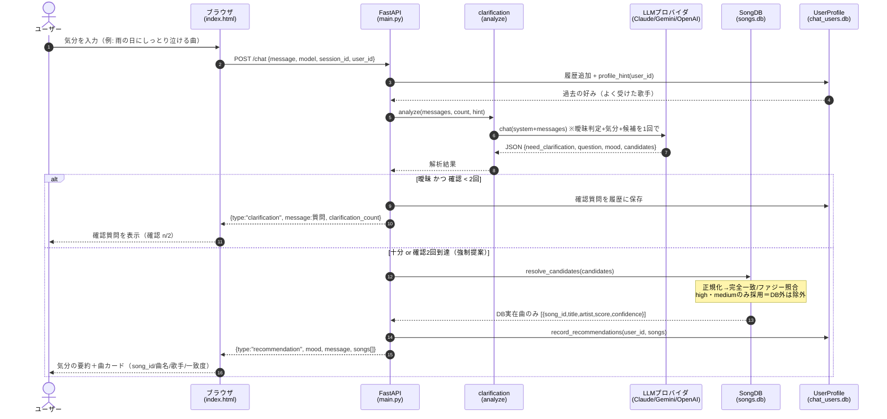
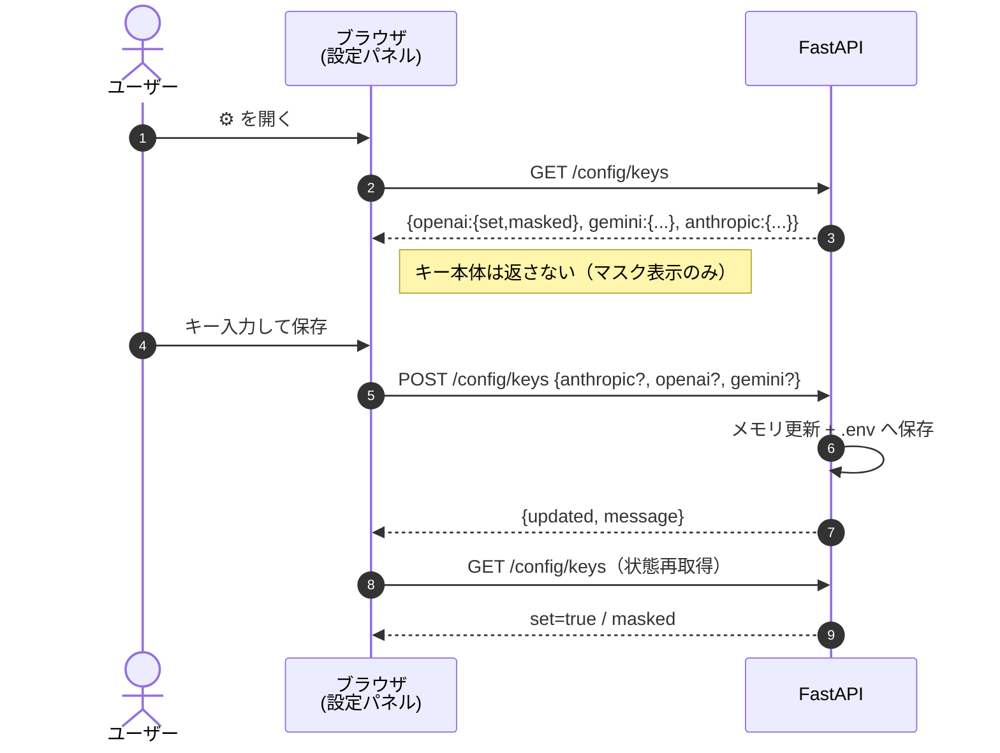
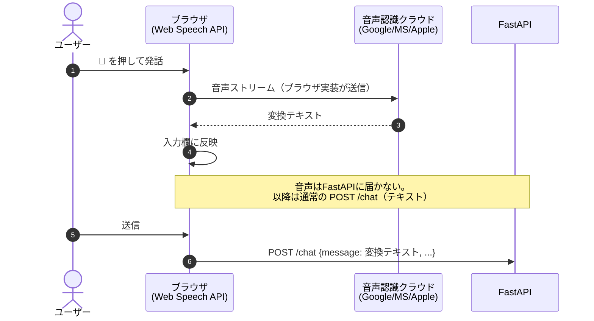

# シーケンス図（クライアント ⇄ バックエンド）

うたレコの通信フロー。すべて REST（HTTP/JSON, `fetch()`）。Mermaid記法なので
GitHub・対応エディタでは図として描画される。

## 1. 楽曲推薦（POST /chat）

## 2. APIキー設定（POST/GET /config/keys）

## 3. 音声入力（クライアント完結、サーバは音声を受け取らない）

## 補足

- LLM呼び出しは **バックエンドからサーバ間**で行う。APIキーはサーバ保管で、ブラウザもLLMベンダーも保持しない。
- `POST /songs/verify`（MCP `verify_songs` と同一IF）等のDB系APIは内部/将来連携用で、現フロントは未使用。
- 詳細な処理仕様は [recommendation-logic.md](recommendation-logic.md) を参照。
